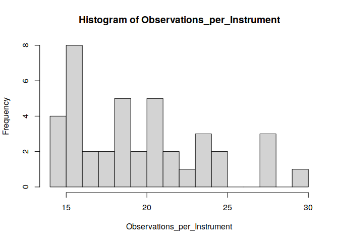

<!-- README.md is generated from README.Rmd. Please edit that file -->

# civ

<!-- badges: start -->

[](https://github.com/thomaswiemann/civ/actions/workflows/R-CMD-check.yaml)
[](https://app.codecov.io/gh/thomaswiemann/civ)
[](https://www.codefactor.io/repository/github/thomaswiemann/civ)
<!-- badges: end -->

`civ` is an implementation of the categorical instrumental variable
estimator proposed by Wiemann (2023; [arxiv:123](https://)). `civ`
allows for optimal instrumental variable estimation in settings with
relatively few observations per category as seen in many economic
applications including judge IV designs. To obtain valid inference in
these challenging empirical settings, `civ` leverages a regularization
assumption that implies existence of a latent categorical variable with
fixed finite support achieving the same first stage fit as the observed
instrument.

See the corresponding working paper [Optimal Categorical Instrumental
Variables](https://) for further discussion and theoretical details.

## Installation

Install the latest development version from GitHub (requires
[devtools](https://github.com/r-lib/devtools) package):

``` r
if (!require("devtools")) {
  install.packages("devtools")
}
devtools::install_github("thomaswiemann/civ", dependencies = TRUE)
```

## Example from the Simulation of Wiemann (2023)

To illustrate `civ` on a simple example, consider the data generating
process from the simulation of Wiemann (2023): For $i = 1, \ldots, n$,
the data generating process is given by $$
    Y_i = D_i \pi_{0}(X_i) + X_i\beta_0 + U_i,\qquad \text{and} \qquad
    D_i= m_0(Z_i) + X_i\gamma_0 + V_i,
$$ where
$(U_i, V_i)\sim \mathcal{N}(0, \left[\begin{smallmatrix} 1 & 0.6 \\ 0.6 & \sigma_V^2 \end{smallmatrix}\right])$,
$D_i$ is a scalar-valued endogenous variable,
$X_i\sim\textrm{Bernoulli}(0.5)$ is a binary covariate and
$\beta_0 = \gamma_0 = 0$, and $Z_i$ is the categorical instrument taking
values in ${1, \ldots, 40\}$ with equal probability. To introduce
correlation between $Z_i$ and $X_i$, I further set
$\Pr(Z_i \text{ is odd}\vert X_i = 0) = \Pr(Z_i \text{ is even}\vert X_i = 1) = 0$.
The optimal instrument $m_0$ is constructed by first partitioning the
support of $Z_i$ into two equal subsets and then assigning either $0$ or
$C$ as values. I choose the scalars $\sigma_V^2$ and $C$ such that the
variance of the first stage variable is fixed to 1 and the concentration
parameter for $n=800$ is $\mu^2 = 180$. The data generating process
allows for individual treatment effects $\pi_0(X_i)$ to differ with
covariates. Here, $\pi_0(X_i) = 1 + 0.5(1 - 2X_i)$ so that the expected
treatment effect is simply $E\pi_0(X) = 1.$

The code snippet below draws $n=800$ observations from this data
generating process.

``` r
# Set seed
set.seed(51944)
# Sample parameters
nobs = 800 # sample size
C = 0.858 # first stage coefficient
sgm_V = sqrt(0.81) # first stage error
tau_X <- c(-0.5, 0.5) + 1 # second stage effects
# Sample controls and instrument
X <- sample(1:2, nobs, replace = T)
Z <- model.matrix(~ 0 + as.factor(sample(1:20, nobs, replace = T)):as.factor(X))
Z <- Z %*% c(1:ncol(Z))
# Create the low-dimensional latent instrument
Z0 <- Z %% 2 # underlying latent instrument
# Draw first and second stage errors
U_V <- matrix(rnorm(2 * nobs, 0, 1), nobs, 2) %*% 
  chol(matrix(c(1, 0.6, 0.6, sgm_V), 2, 2))
# Draw treatment and outcome variables
D <- Z0 * C + U_V[, 2]
y <- D * tau_X[X] + U_V[, 1]
```

In the generated sample, the observed instrument takes 40 values with
varying numbers of observations per instrument:

``` r
Observations_per_Instrument = table(Z)
hist(Observations_per_Instrument, breaks = 20)
```

<!-- -->

Using only the observed instrument `Z`, the goal is to estimate the
in-sample average treatment effect:

``` r
mean(tau_X[X])
#> [1] 1.0325
```

### Estimate CIV

We load the `civ` package and estimate the categorical instrumental
variable estimator where the first stage is restricted to `K=2` support
points. We also load the `AER` package to compute heteroskedasticity
robust standard errors.

``` r
# Load dependencies
library(civ)
library(AER)

# Compute CIV with K=2 and conduct inference
civ_fit <- civ(y = y, D = D, Z = Z, X = as.factor(X), K = 2)
civ_res <- summary(civ_fit, vcov = vcovHC(civ_fit$iv_fit, type = "HC1"))
```

The CIV estimate and the corresponding standard error are shown below.
The associated 95% confidence interval covers the true effect as
indicated by the *t*-value of less than 1.96.

``` r
c(Estimate = civ_res$coef[2, 1], "Std. Error" = civ_res$coef[2, 2], 
  "t-val." = abs(civ_res$coef[2, 1]-mean(tau_X[X]))/civ_res$coef[2, 2])
#>   Estimate Std. Error     t-val. 
#>  1.0063143  0.1086868  0.2409285
```

## Why does CIV do well?

The key idea of CIV is to leverage a latent categorical variable `Z0`
with fewer categories that achieves the same population-level fit in the
first stage as the observed instrument `Z`. Under the assumption that
the support of the latent categorical variable is fixed with finite
cardinality, it is possible to estimate a mapping from the observed
categories to the latent categories. This estimated mapping can then be
used to simplify the optimal instrumental variable estimator to a finite
dimensional regression problem. Asymptotic properties of the CIV
estimator then follow if the first-stage mapping can be estimated at a
sufficient rate.

Wiemann (2023) provides sufficient conditions for estimation of the
mapping at exponential rate using a K-Conditional-Means (KCMeans)
estimator. The proposed KCMeans estimator is exact and computes very
quickly with time polynomial in the number of observed categories, thus
avoiding heuristic solution approaches otherwise associated with
KMeans-type problems. See also the
[`kcmeans`](https://www.thomaswiemann.com/kcmeans) R package for
additional details.

In the considered data generating process, the underlying optimal
instrument `Z0` has two support points. In the first step, CIV attempts
to map values of the observed instrument to these support points. The
below code snippet shows that is largely succeeds in doing so: Among the
800 observations, only 16 observations are missclassified.

``` r
# Compute the clustering of instrument values
Z0_hat <- predict(civ_fit$kcmeans_fit, Z, clusters=T) - 1

# Compare clusters with the true underlying instrument Z0
missclassified <- ((Z0 - Z0_hat) != 0)
sum(missclassified)
#> [1] 16
```

Thanks to classifying values of the instrument in the first step, the IV
estimation problem substantially simplifies: Instead of using a
categorical instrument with 40 values, CIV is equivalent to using the
constructed binary instrument:

``` r
# Equivalent CIV using the constructed binary instrument
civ_fit_2 <- ivreg(y ~ D + as.factor(X) | as.factor(Z0_hat) + as.factor(X))
civ_res_2 <- summary(civ_fit_2, vcov = vcovHC(civ_fit_2, type = "HC1"))$coef

# Equivalent CIV results:
c(Estimate = civ_res_2[2, 1], "Std. Error" = civ_res_2[2, 2], 
  "t-val." = abs(civ_res_2[2, 1]-mean(tau_X[X]))/civ_res_2[2, 2])
#>   Estimate Std. Error     t-val. 
#>  1.0063143  0.1086868  0.2409285
```

Since correct classification requires very few observations per
instrument, CIV is nearly identical to the infeasible orcle estimator
that presumes knowledge of the low-dimensional optimal instrument Z0:

``` r
# Compute the infeasible oracle estimator
oracle_fit <- ivreg(y ~ D + as.factor(X) | as.factor(Z0) + as.factor(X))
oracle_res <- summary(oracle_fit, vcov = vcovHC(oracle_fit, type = "HC1"))

# Infeasible oracle results:
c(Estimate = oracle_res$coef[2, 1], "Std. Error" = oracle_res$coef[2, 2], 
  "t-val." = abs(oracle_res$coef[2, 1]-mean(tau_X[X]))/oracle_res$coef[2, 2])
#>   Estimate Std. Error     t-val. 
#>  1.0184144  0.1065979  0.1321376
```

## Comparison of CIV to Alternative Optimal Instrument Estimators

To provide some evidence for the practical benefits of CIV over
alternative estimators, consider estimating three commonly considered
alternatives: two-stage least squares (TSLS), the post-Lasso IV
estimator of Belloni et al. (2012), and an IV estimator that uses random
forests in the first stage.

Key takeaways from the results: TSLS, post-Lasso IV, and random
forest-based IV are heavily biased.

For extensive finite-sample comparisons, see Wiemann (2023;
[arxiv:123](https://)).

### TSLS

The TSLS estimate is substantially more biased than the CIV estimate.

``` r
# Estimate two-stage least squares
tsls_fit <- ivreg(y ~ D + as.factor(X) | as.factor(Z) + as.factor(X))
tsls_res <- summary(tsls_fit, vcov = vcovHC(tsls_fit, type = "HC1"))$coef

# TSLS results:
c(Estimate = tsls_res[2, 1], "Std. Error" = tsls_res[2, 2], 
  "t-val." = abs(tsls_res[2, 1]-mean(tau_X[X]))/tsls_res[2, 2])
#>   Estimate Std. Error     t-val. 
#> 1.11620022 0.08664093 0.96605856
```

### Post-Lasso IV

The post-Lasso IV estimator of Belloni et al. (2012) is heavily biased
and the corresponding 95% confidence interval does *not* cover the
in-sample treatment effect as indicated by the *t*-value of more than
1.96.

``` r
# Estimate post-Lasso IV with the plug-in penalty
library(hdm)
hdm_fit <- rlassoIV(y ~ D + as.factor(X) | as.factor(Z) + as.factor(X), 
                    select.X = F)
hdm_res <- c(hdm_fit$coefficients, hdm_fit$se)

# post-Lasso IV results:
c(Estimate = hdm_res[1], "Std. Error" = hdm_res[2], 
  "t-val." = abs(hdm_res[1]-mean(tau_X[X]))/hdm_res[2])
#>   Estimate.D Std. Error.D     t-val..D 
#>    0.7717395    0.1059556    2.4610350
```

### Random Forest IV

The random forest-based IV estimator is heavily biased and the
corresponding 95% confidence interval does *not* cover the in-sample
treatment effect as indicated by the *t*-value of more than 1.96.

``` r
library(ranger)
df <- data.frame(D = D, Z = as.factor(Z), X = as.factor(X))
mhat <- predict(ranger(D ~  Z + X, data = df), df)$predictions
ranger_fit <- ivreg(y ~ D + as.factor(X) | mhat + as.factor(X))
ranger_res <- summary(ranger_fit, vcov = vcovHC(ranger_fit, type = "HC1"))$coef

c(Estimate = ranger_res[2, 1], "Std. Error" = ranger_res[2, 2], 
  "t-val." = abs(ranger_res[2, 1]-mean(tau_X[X]))/ranger_res[2, 2])
#>   Estimate Std. Error     t-val. 
#> 1.25887072 0.09053253 2.50043521
```

# References

Wiemann T (2023). “Optimal Categorical Instruments.”

Belloni A, Chen D, Chernozhukov V, Hansen C (2018). “Sparse Models and
Methods for Optimal Instruments With an Application to Eminent Domain.”
Econometrica, 80(6), 2369-2429.
